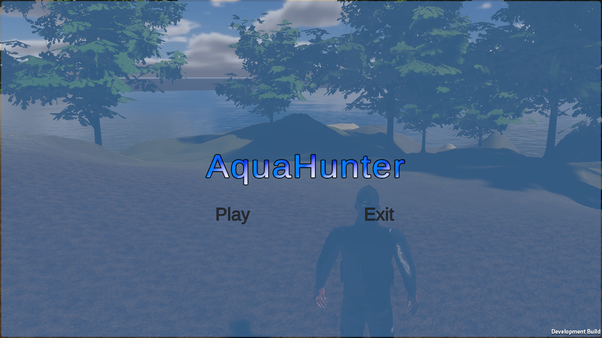
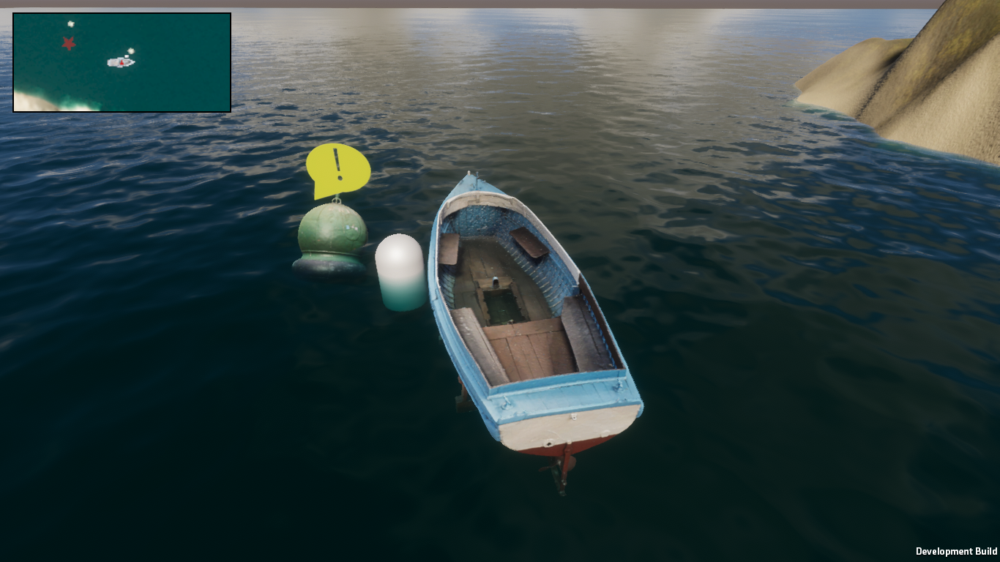
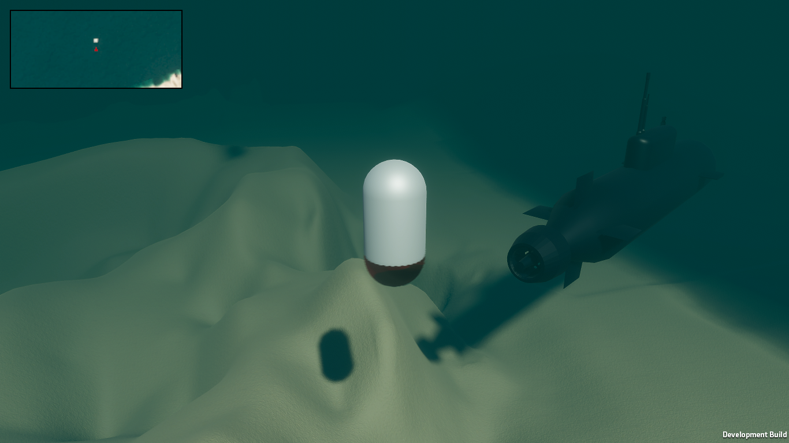
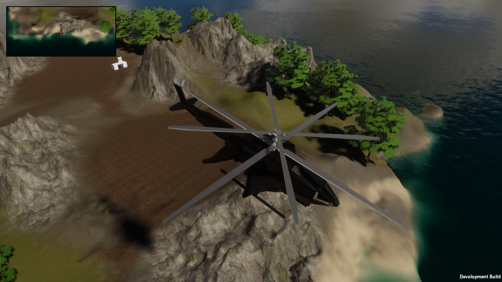

# AquaHunter - Sonobuoy simulation 

Take to the open water in a quest to hunt submarines.

## Installation
Made with Unity 2022.3.41f1. The project can be imported through Unity Hub to view and update the source code.

A Windows executable is available in the "Aqua_Build" directory.

## Controls:
- Mouse Scrollwheel - Switch vehicle
- WASD / Arrow keys - Player movement / Adjust sonobuoy depth
- B - Deploy sonobuoy
- E - Adjust deployed sonobuoy
- Space - End deployment

## Gameplay
 

 

